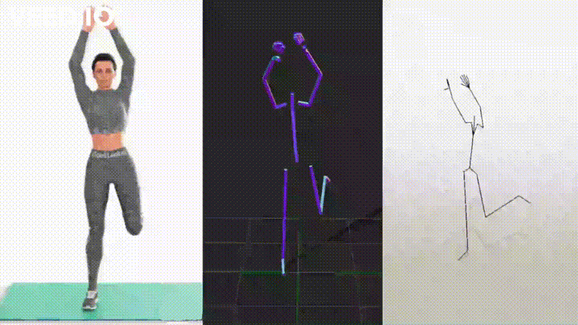

# Intro 
Biovision hierarchy files to internal deepmimic representation converter.


#Build instructions(for Ubuntu 20.04):
 1. sudo apt-get install libeigen3-dev
 2. mkdir build && cd build
 3. cmake ..
 4. cmake --build .

# Output format
The output will be two file:
 1. Charactech file '*.char'
 2. Motion file '*.motion' in the following format:
```
[
    duration of frame in seconds (1D),
    root position (3D),
    root rotation (4D),
    chest rotation (4D),
    neck rotation (4D),
    right hip rotation (4D),
    right knee rotation (1D),
    right ankle rotation (4D),
    right shoulder rotation (4D),
    right elbow rotation (1D),
    left hip rotation (4D),
    left knee rotation (1D),
    left ankle rotation (4D),
    left shoulder rotation (4D),
    left elbow rotation (1D)
]
```